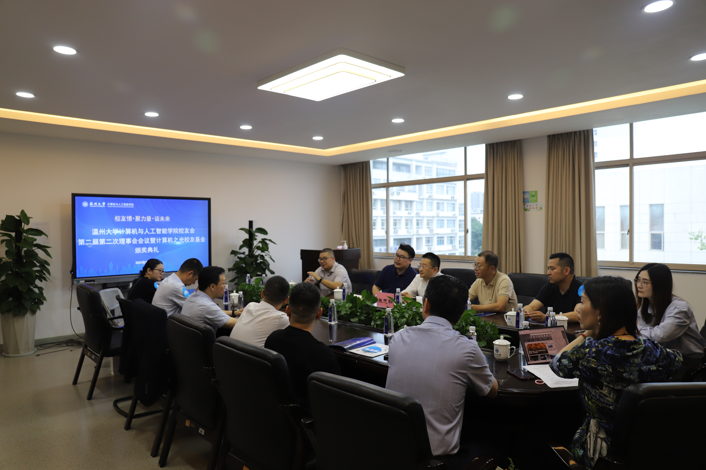

---
# Basic Post Information
title: "The Alumnus Day 5.19 / Prize Acceptance"
date: 2025-05-18T16:50:15+08:00
# lastmod: 2025-05-18T16:50:15+08:00
draft: true 

# Author Information
author: "Jona"
# For multiple authors, uncomment and use this format:
# authors: ["Author 1", "Author 2"]

# Content Metadata
description: "Several of our teams of Computer Science and Artificial Intelligence won the prize of 'Computer Talent Award'. And I am one of them."
tags: ["Alumnus", "Prize"]
categories: ["Posts"]
weight: 1

# SEO and Canonical URLs
canonicalURL: "https://yourdomain.com/posts/alumnus-prize-giving"
# Uncomment if you want to prevent search engines from indexing this post
# noindex: true

# Social Media Preview
# These fields are used for Open Graph and Twitter Cards
og_image: images/og-image.jpg
twitter_image: images/twitter-image.jpg

# Cover Image
cover:
    image: images/获奖学生代表发言.JPG
    alt: "Student representative give a speech."
    caption: "Jona is giving a speech as a prize ower student representative."
    relative: true 
    hidden: false

# Table of Contents Settings
showToc: true
TocOpen: false
UseHugoToc: true

# Display Settings
ShowReadingTime: true
ShowBreadCrumbs: true
ShowPostNavLinks: true
ShowWordCount: true
ShowRssButtonInSectionTermList: true

# Content Features
comments: true
disableHLJS: false
disableShare: false
hideSummary: false
searchHidden: false

# Edit Post Link
editPost:
    URL: "https://github.com/yourusername/your-repo/edit/main/content/posts/alumnus-prize-giving.md"
    Text: "Suggest Changes"
    appendFilePath: true

# Series Information (if this post is part of a series)
series: ["Prize"]
series_order: 1

# Related Posts (optional)
related:
  - "post-slug-1"
  - "post-slug-2"
---

## Alumnus giving a prize to student teams
Due to the contribution toward the institute, several of the college students who are the team leader are called to accept the award of the 'Computer Talent Award'. The award is founded by the Alumnus of our institute.

## The Prize-Acceptance list

## The group photo of Alumnus and college leaders

## The group photos of Award Winner

## Bonus detail 
For the case that PeiJie Wang needs to give a speech in the school competition of the Internet 2025, I becomes the award-winning representative.

