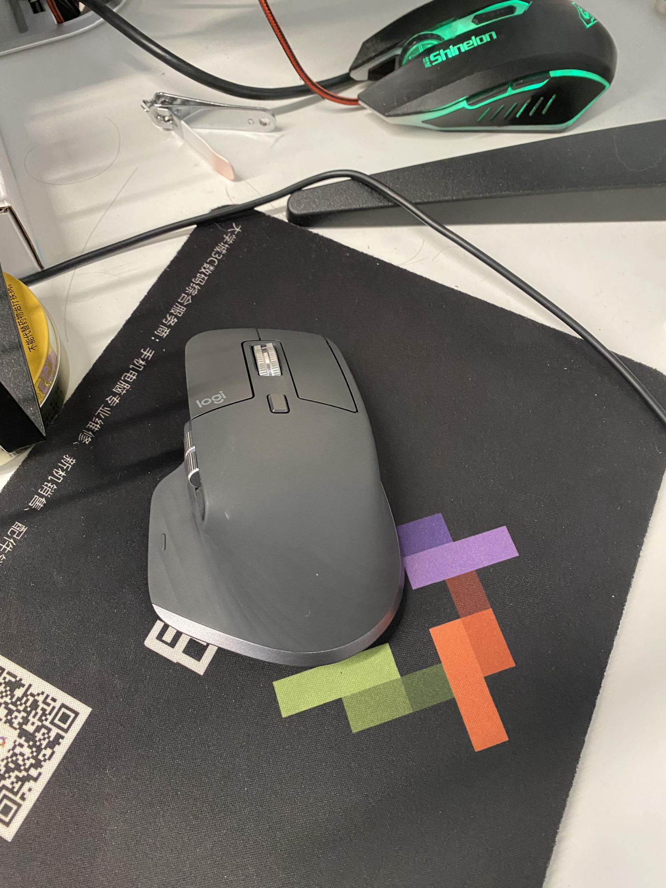
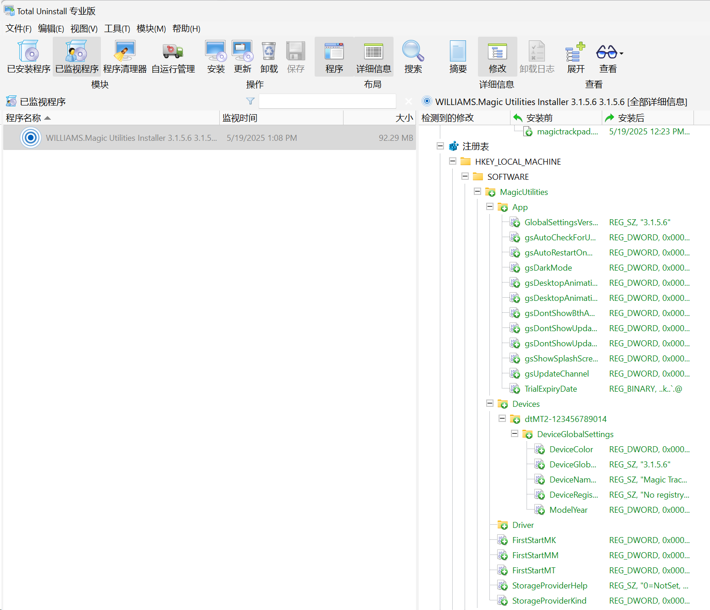
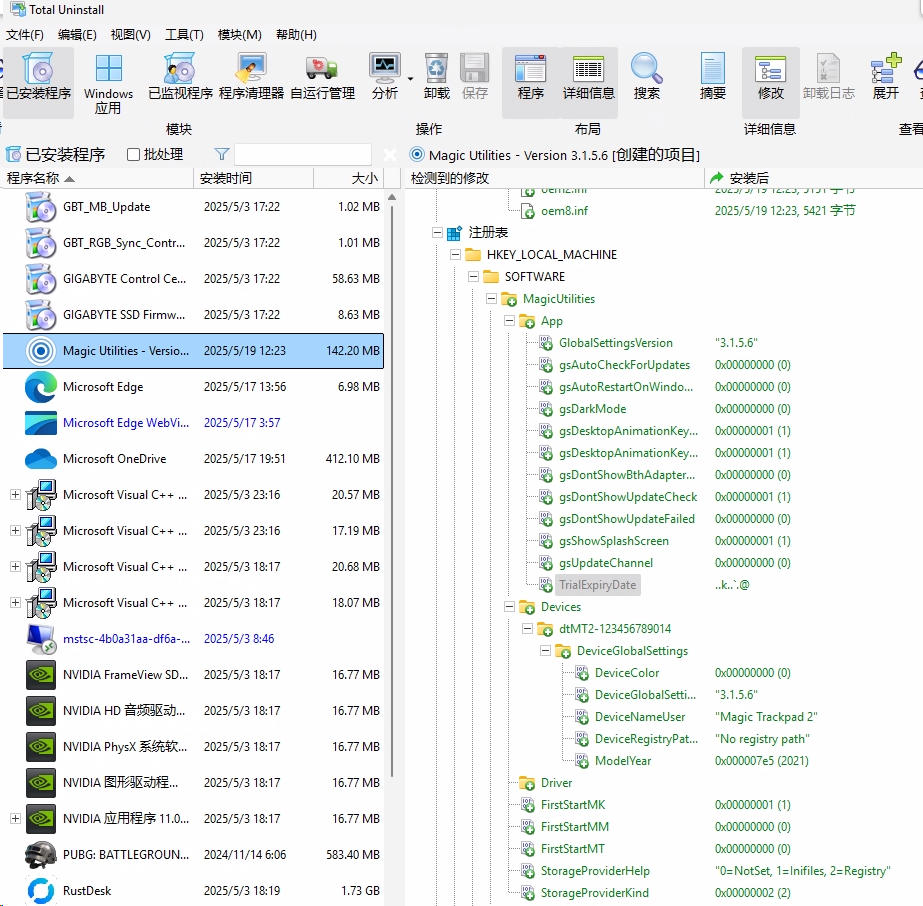
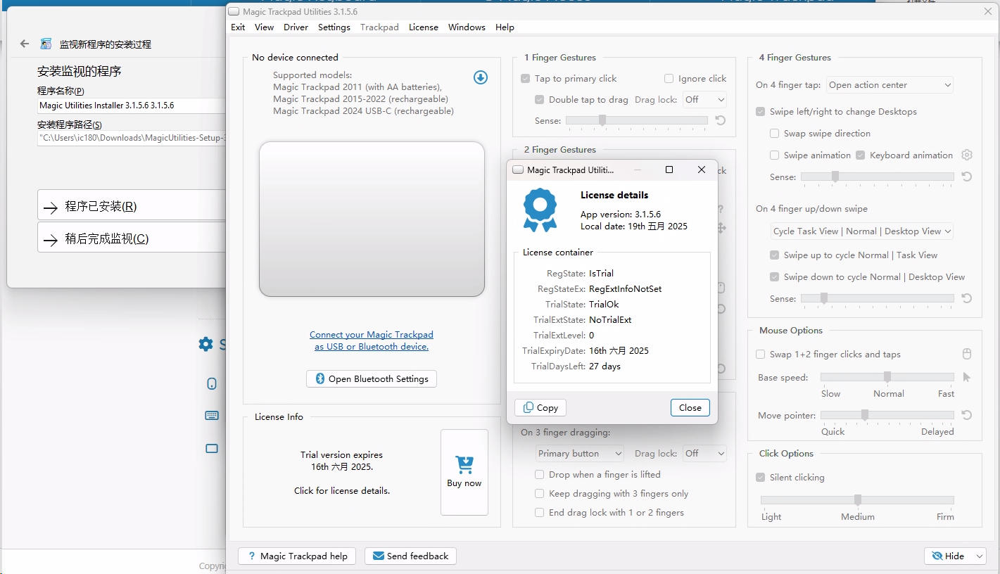
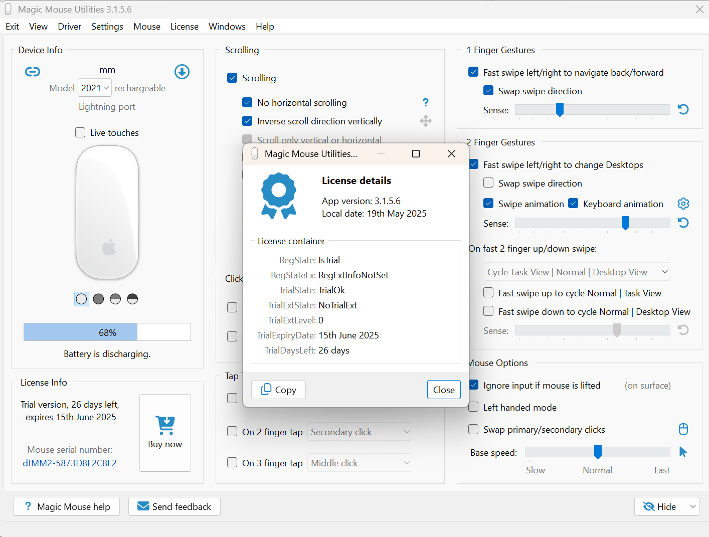

---
# Basic Post Information
title: "How To Do A Software Trail Reset"
date: 2025-05-19T13:52:52+08:00
# lastmod: 2025-05-19T13:52:52+08:00
draft: true 

# Author Information
author: "Jona"
# For multiple authors, uncomment and use this format:
# authors: ["Author 1", "Author 2"]

# Content Metadata
description: "Bypass the software Magic Utilities trail." 
tags: ["Software reset", "Trail reset"]
categories: ["Tool"]
weight: 1

# SEO and Canonical URLs
canonicalURL: "https://yourdomain.com/posts/bypass-software-trail"
# Uncomment if you want to prevent search engines from indexing this post
# noindex: true

# Social Media Preview
# These fields are used for Open Graph and Twitter Cards
og_image: images/og-image.jpg
twitter_image: images/twitter-image.jpg

# Cover Image
cover:
    image: images/trail_expired_warning.jpg
    alt: "Trail expired warning."
    caption: "Software trail expired warning."
    relative: true 
    hidden: false

# Table of Contents Settings
showToc: true
TocOpen: false
UseHugoToc: true

# Display Settings
ShowReadingTime: true
ShowBreadCrumbs: true
ShowPostNavLinks: true
ShowWordCount: true
ShowRssButtonInSectionTermList: true

# Content Features
comments: true
disableHLJS: false
disableShare: false
hideSummary: false
searchHidden: false

# Edit Post Link
editPost:
    URL: "https://github.com/yourusername/your-repo/edit/main/content/posts/bypass-software-trail.md"
    Text: "Suggest Changes"
    appendFilePath: true

# Series Information (if this post is part of a series)
series: ["post"]
series_order: 1

# Related Posts (optional)
related:
  - "post-slug-1"
  - "post-slug-2"
---

## How did I bypass or reset the software trail
### Background
I have my magic mouse, magic trackpad, and my magic keyboard, for the convinience, I use them in my newly installed windows. After a long time searching, I have found a good software which helps me to use those device in windows like I am using a Mac, this means I have all the abilities that those device have had in a MacOS. And this software is called [Magic Utilities](https://magicutilities.net/).

However, there are only 28 days trail for using. After the trail ended, I have tried the a open-source software called [mac-precision-touchpad](https://github.com/imbushuo/mac-precision-touchpad), which indeed make the touchpad a little bit more useful in a windows OS. While there is way to compare with the Magic Utilities. What's worse, I can not scroll by this mouse. The only one that I can use is the magic keyboard.

Those days, my girlfriend bought me a new mouse, which is really efficient to use during work. And most of the time, I bring it to my office. After work, I bought it home. There is sometime I may forget to bring, so I want to find a way to fix the trail problem.

## The material you need for trail reset
- Total Uninstall Pro (Pro for restore program)

- A fresh install of the Trail software (in this post: Magic Utilities)

## The scenario of my circumstance
- A dormitory windows which had Magic Utilities expired
  - Install Total Uninstall Pro
  - Installed a expired Magic Utilities

- A windows in office which had a fresh install of Magic Utilities (which left 27 days to expire)
  - Install Total Uninstall (No Pro version needed since backup the software is basic function)
  - First time install Magic Utilities in this windows

## The trail reset flow
For fresh install Magic Utilities Windows
1. Fresh install Magic Utilities in windows
2. Install Total Uninstall in windows
3. Select the Magic Utilities in Total Uninstall
4. Click file in the manu
5. Choose create program backup in the list
6. Choose a destination to store the backup (a zip file which includes some of the most important file for a fresh install)
   
For expired Magic Utilities Windows
- Open Total Uninstall Pro in windows (the trail expired windows)
- Click the expired software
- Click file in the manu
- Choose the restore backed software
- Choose the zip file from the destination folder
- Waiting for the restore process finishing

## The effect of expired trail software after trail reset flow
